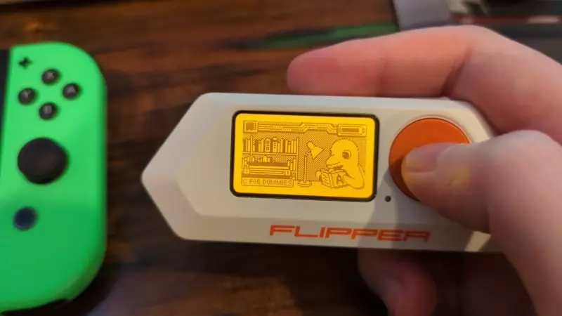

# FlipMiibo
Convert BIN to Flipper Zero compatible NFC format

## Usage
1. Drop FlipMiibo.py into directory containing BIN files
2. Open a terminal and navigate to that directory
3. Run `python3 FlipMiibo.py`
4. Move newly created .nfc files to your Flipper Zero's sd card.
5. ???
6. Profit!

## Requirements
Python3
